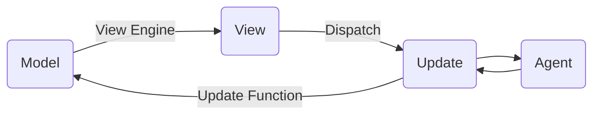

# Agents

## Managing side effects
A *side effect* is any action **not** directly dispatched by the user.

* POST initiates HTTP call and emits a new message when response is received
* *Poll* emits a POST command every X seconds. Terminates when response is OK
* *Debounce* is triggered by user interaction, emits POST when interaction stops.

## Agent Architecture

