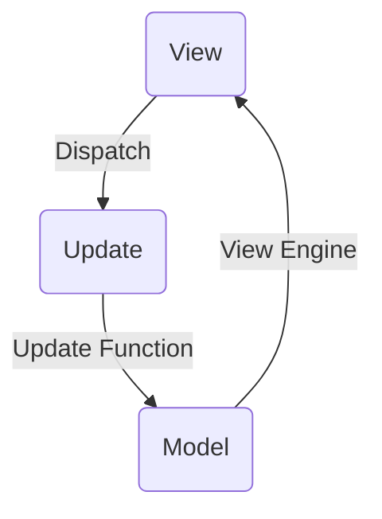
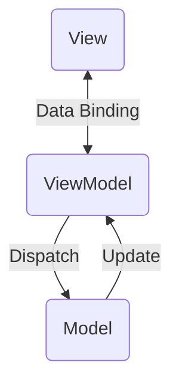
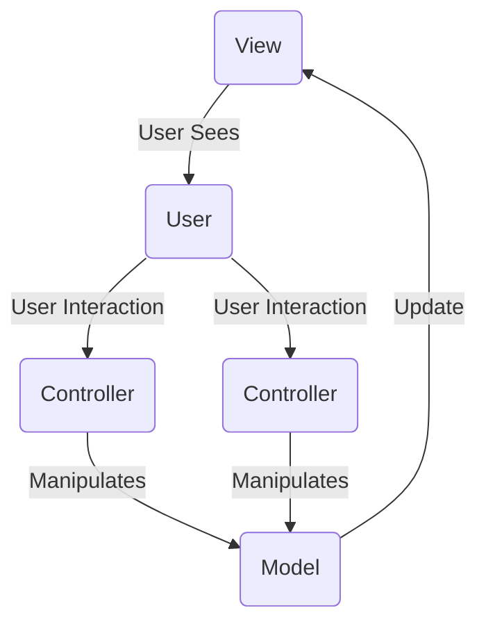

# M-V-U Architecture

## M-V-U 

* All updates to model are dispatched through a single message queue
* Model is represented by immutable data
* View updated when model changes

## M-V-VM (Not Unidirectional!)

## M-V-C (Not Immutable!)

